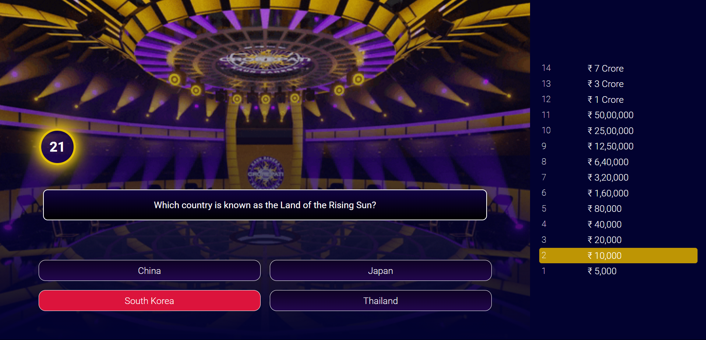

.............

Here's a detailed `README.md` for your KBC (Kaun Banega Crorepati) web app using React:

```markdown
# KBC (Kaun Banega Crorepati) Web App

Welcome to the KBC (Kaun Banega Crorepati) Web App! This project is a recreation of the popular game show "Kaun Banega Crorepati" using React. Test your general knowledge and try to win the top prize by answering multiple-choice questions correctly.

## Table of Contents
- [Features](#features)
- [Screenshots](#screenshots)
- [Installation](#installation)
- [Usage](#usage)
- [Project Structure](#project-structure)
- [Contributing](#contributing)
- [License](#license)

## Features

- **Multiple-choice questions:** Answer questions to win virtual currency.
- **Progressive difficulty:** Questions increase in difficulty as you progress.
- **Sound effects:** Different sounds for correct and incorrect answers.
- **Animations:** Visual feedback for correct and incorrect answers.
- **Dynamic score:** Track your earnings as you play.
- **Game Over:** Displays total earnings when the game ends.

## Screenshots


*Main page of the game.*


*Correct answer with green highlight and sound effect.*


*Wrong answer with red highlight and sound effect.*


*Game over screen showing the total earnings.*

## Installation

To run this project locally, follow these steps:

1. **Clone the repository:**

   ```bash
   git clone https://github.com/yourusername/kbc-web-app.git
   cd kbc-web-app
   ```

2. **Install dependencies:**

   ```bash
   npm install
   ```

3. **Start the development server:**

   ```bash
   npm start
   ```

   The app will be available at `http://localhost:3000`.

## Usage

1. **Start the game:** The game starts automatically when you open the app.
2. **Answer questions:** Click on the answer you think is correct.
3. **Track your progress:** Your current earnings are displayed on the right.
4. **Game Over:** When you answer a question incorrectly, the game ends and your total earnings are displayed.

## Project Structure

```
kbc-web-app
│   README.md
│   package.json
│   .gitignore
├───public
│       index.html
│       ...
├───src
│   │   index.js
│   │   App.js
│   │   app.css
│   ├───components
│   │       Trivia.jsx
│   ├───assets
│   │       play.mp3
│   │       correct.mp3
│   │       wrong.mp3
│   └───data
│           data.js
```

- **public:** Contains the HTML file.
- **src:** Contains the source code for the app.
  - **components:** Contains the Trivia component.
  - **assets:** Contains the sound files.
  - **data:** Contains the questions data.

## Contributing

Contributions are welcome! Please feel free to submit a Pull Request.

## License

This project is licensed under the MIT License. See the [LICENSE](LICENSE) file for details.
```

### Note:

1. Replace the `screenshots` section with actual screenshots of your app.
2. Replace `"https://github.com/yourusername/kbc-web-app.git"` with the actual URL of your GitHub repository.
3. Ensure the `screenshots` folder exists in the repository and contains the relevant images.

This `README.md` provides a comprehensive guide to understanding, installing, and using your KBC web app.